# 💻SQL Syntax Project Practical

## 🪧Intruduction
After learning about the basic concepts of SQL it also need to know basic syntax and understand how to implement data manipulation and filtering. 

To further extend knowledge and understanding of SQL, the project demonstrated how to work with subqueries, group data, work with null values and tables.

## 🔎Skills Demonstrated

1️⃣	**Count Cities in USA: Scenario:** You've been tasked with conducting a demographic analysis of cities in the United States.Your first step is to determine the total number of cities within the country to provide a baseline for further analysis.

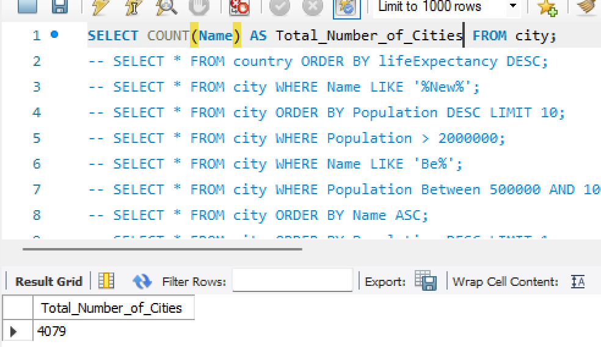

2️⃣	**Country with Highest Life Expectancy:** Scenario: As part of a global health initiative, you've been assigned to identify the country with the highest life expectancy. This information will be crucial for prioritising healthcare resources and interventions.

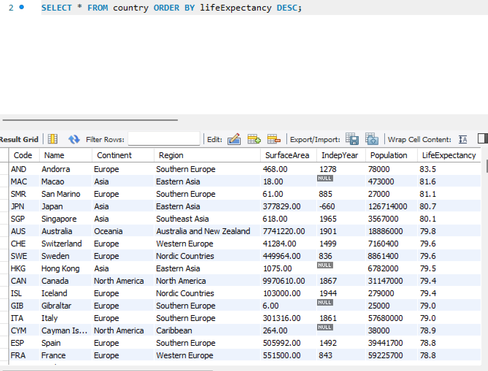

3️⃣	**"New Year Promotion: Featuring Cities with 'New :** Scenario: In anticipation of the upcoming New Year, your travel agency is gearing up for a special promotion featuring cities with names including the word 'New'. You're tasked with swiftly compiling a list of all cities from around the world. This curated selection will be essential in creating promotional materials and enticing travellers with exciting destinations to kick off the New Year in style.

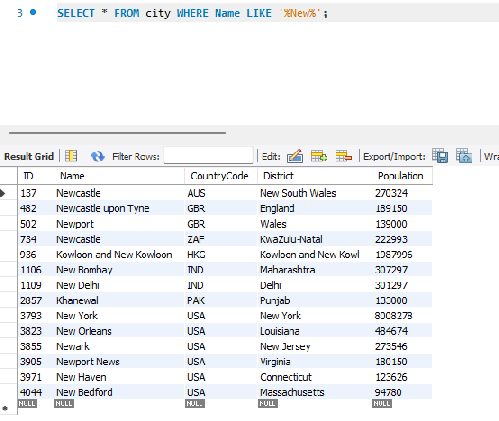

4️⃣	**Display Columns with Limit (First 10 Rows):** Scenario: You're tasked with providing a brief overview of the most populous cities in the world. To keep the report concise, you're instructed to list only the first 10 cities by population from the database.

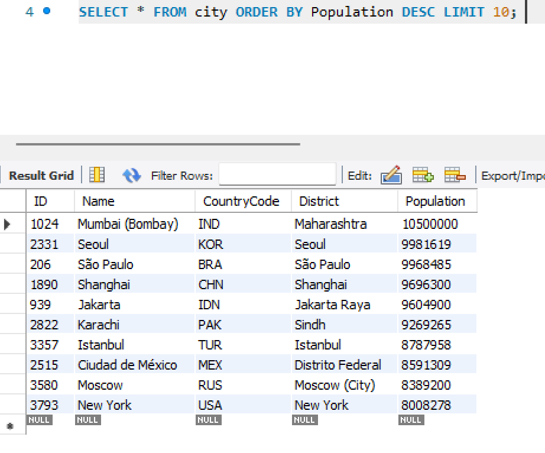

5️⃣	**Cities with Population Larger than 2,000,000: Scenario:** A real estate developer is interested in cities with substantial population sizes for potential investment opportunities. You're tasked with identifying cities from the database with populations exceeding 2 million to focus their research efforts.

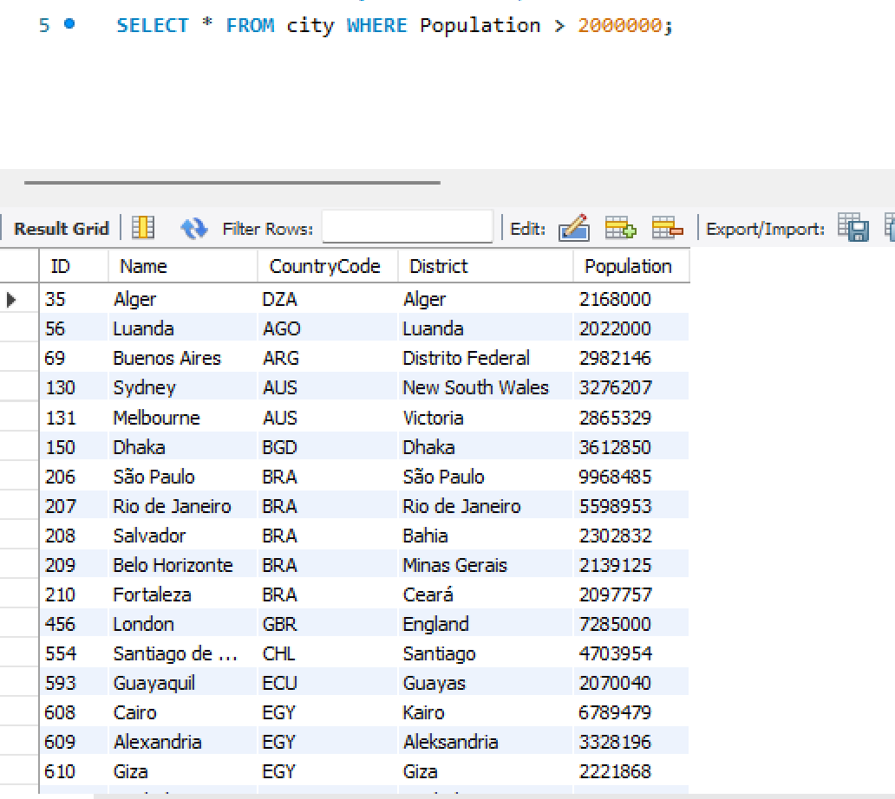

6️⃣	**Cities Beginning with 'Be' Prefix: Scenario:** A travel blogger is planning a series of articles featuring cities with unique names. You're tasked with compiling a list of cities from the database that start with the prefix 'Be' to assist in the blogger's content creation process.

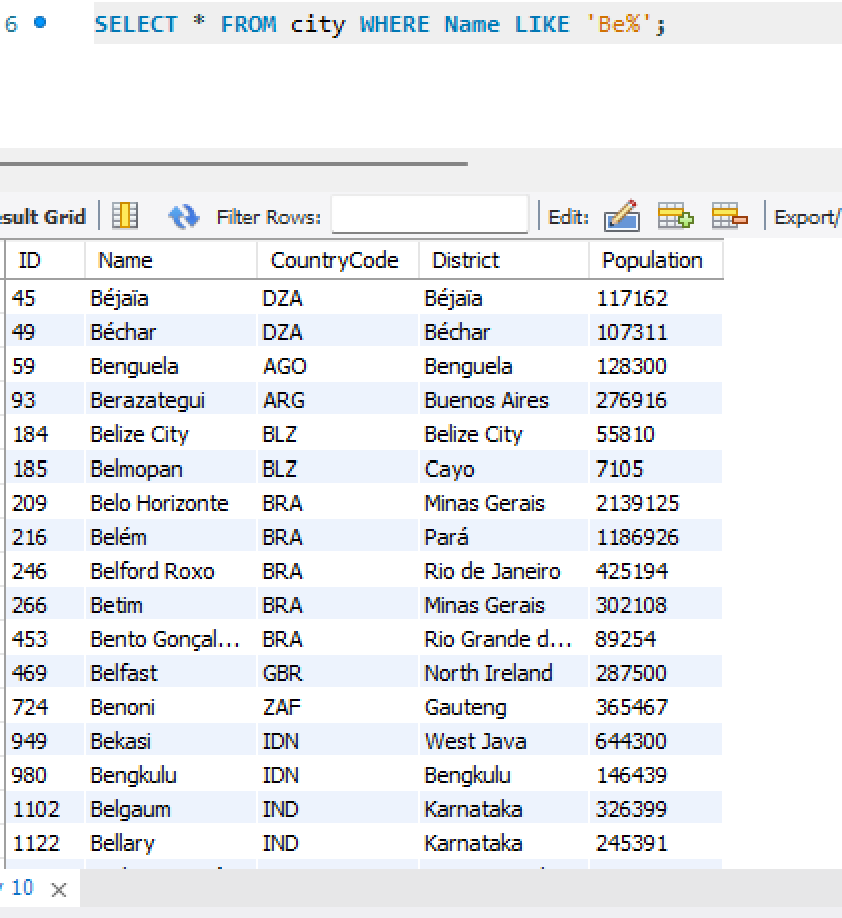

7️⃣	**Cities with Population Between 500,000-1,000,000:** Scenario: An urban planning committee needs to identify mid-sized cities suitable for infrastructure development projects. You're tasked with identifying cities with populations ranging between 500,000 and 1 million to inform their decision-making process.

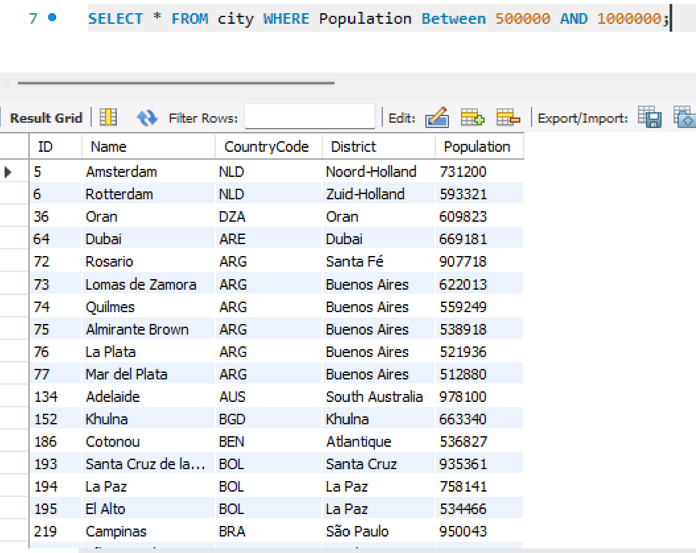

8️⃣	**Display Cities Sorted by Name in Ascending Order: Scenario:** A geography teacher is preparing a lesson on alphabetical order using city names. You're tasked with providing a sorted list of cities from the database in ascending order by name to support the lesson plan.

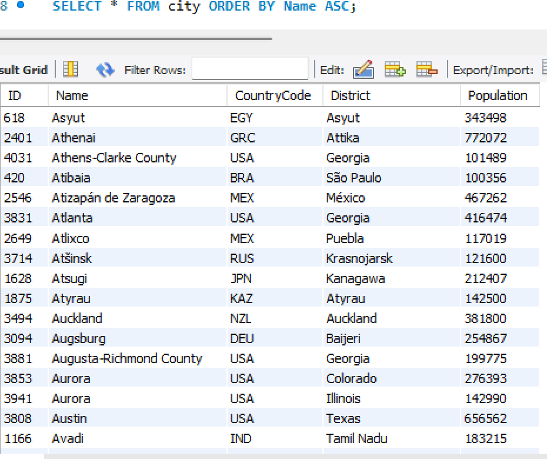

9️⃣	**Most Populated City: Scenario:** A real estate investment firm is interested in cities with significant population densities for potential development projects. You're tasked with identifying the most populated city from the database to guide their investment decisions and strategic planning.

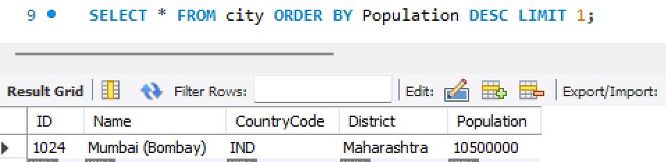

1️⃣0️⃣	 **City Name Frequency Analysis: Supporting Geography Education Scenario:** In a geography class, students are learning about the distribution of city names around the world. The teacher, in preparation for a lesson on city name frequencies, wants to provide students with a list of unique city names sorted alphabetically, along with their respective counts of occurrences in the database. You're tasked with this sorted list to support the geography teacher.

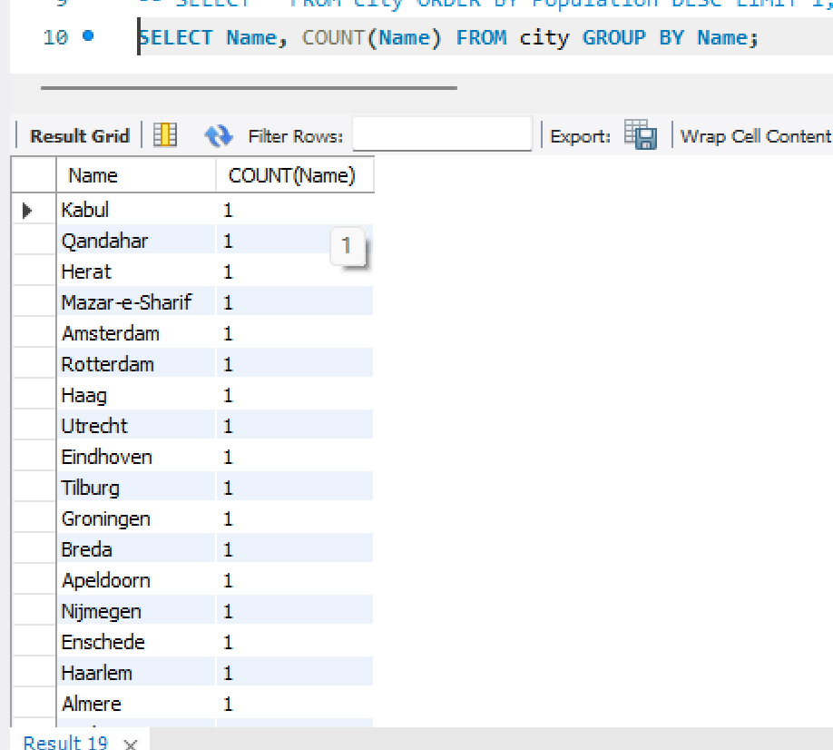

1️⃣1️⃣	**City with the Lowest Population: Scenario:** A census bureau is conducting an analysis of urban population distribution. You're tasked with identifying the city with the lowest population from the database to provide a comprehensive overview of demographic trends.

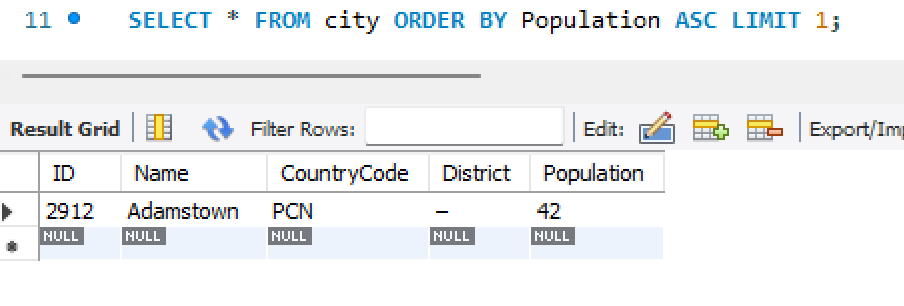

1️⃣2️⃣	**Country with Largest Population: Scenario:** A global economic research institute requires data on countries with the largest populations for a comprehensive analysis. You're tasked with identifying the country with the highest population from the database to provide valuable insights into demographic trends.

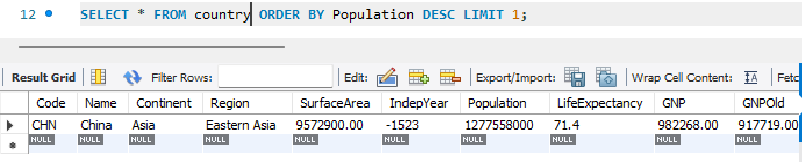

1️⃣3️⃣	**Capital of Spain: Scenario:** A travel agency is organising tours across Europe and needs accurate information on capital cities. You're tasked with identifying the capital of Spain from the database to ensure itinerary accuracy and provide travellers with essential destination information.

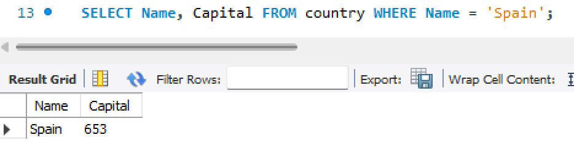

1️⃣4️⃣	**Cities in Europe: Scenario:** A European cultural exchange program is seeking to connect students with cities across the continent. You're tasked with compiling a list of cities located in Europe from the database to facilitate program planning and student engagement.

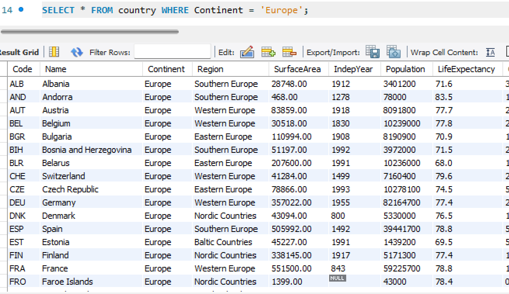

1️⃣5️⃣	**Average Population by Country: Scenario:** A demographic research team is conducting a comparative analysis of population distributions across countries. You're tasked with calculating the average population for each country from the database to provide valuable insights into global population trends.

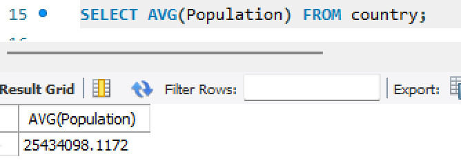

1️⃣6️⃣	**Capital Cities Population Comparison: Scenario:** A statistical analysis firm is examining population distributions between capital cities worldwide. You're tasked with comparing the populations of capital cities from different countries to identify trends and patterns in urban demographics.

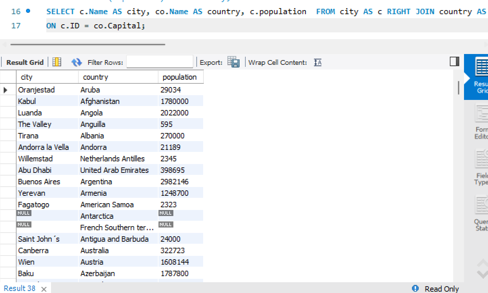

1️⃣7️⃣	**Countries with Low Population Density:** Scenario: An agricultural research institute is studying countries with low population densities for potential agricultural development projects. You're tasked with identifying countries with sparse populations from the database to support the institute's research efforts.

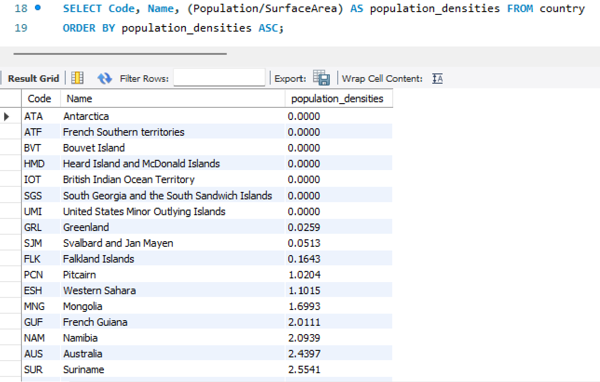

1️⃣8️⃣	**Cities with High GDP per Capita: Scenario:** An economic consulting firm is analysing cities with high GDP per capita for investment opportunities. You're tasked with identifying cities with above-average GDP per capita from the database to assist the firm in identifying potential investment destinations.

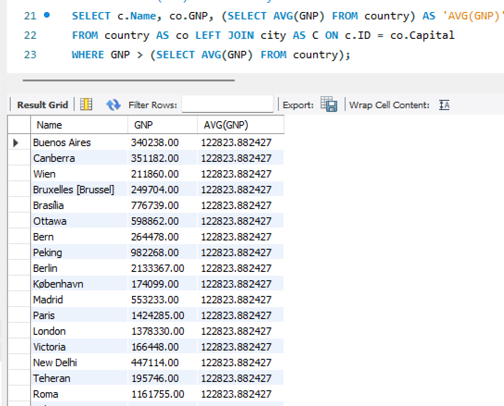

1️⃣9️⃣	**Display Columns with Limit (Rows 31-40):** Scenario: A market research firm requires detailed information on cities beyond the top rankings for a comprehensive analysis. You're tasked with providing data on cities ranked between 31st and 40th by population to ensure a thorough understanding of urban demographics.

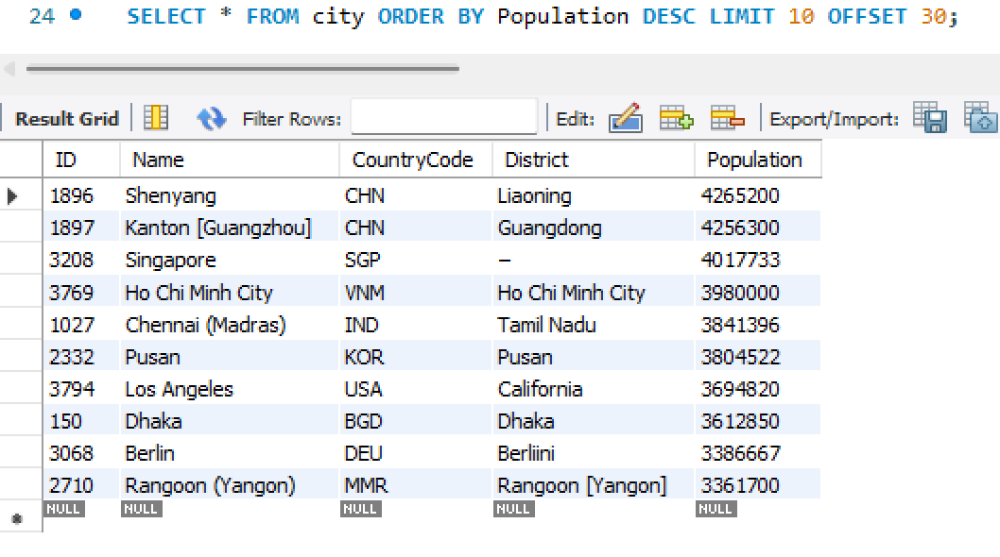

# Project Competencies
## 📊 Analytical Skills
  🧮Aggregation
  Use COUNT, AVG, and GROUP BY to summarize data.

  🔍 Filtering
  Apply WHERE, LIKE, and BETWEEN to filter records.

  📊 Sorting
  Use ORDER BY to sort results.

  🎯 Limiting
  Use LIMIT to restrict the number of returned rows.

  🔗 JOINs
  Use JOIN to combine related tables.

  🌍 Population Analysis
  Analyze population trends using aggregated data.

  👥 Demographic Comparisons
  Compare different demographic groups to identify patterns.

## 🔐 Database Maintenance & Security
  🔑 Primary Key Constraints
  Ensure each table has a unique identifier for its records.

  🔗 Foreign Key Relationships
  Link tables together to maintain relational integrity.

  🚫 NOT NULL Constraints
  Prevent missing values by requiring data in specific columns.

  ✔️ Data Validation
  Apply rules to ensure data is accurate and meaningful.

  💾 Backup Planning
  Prepare regular backups to protect data from loss.

  🔐 Access Control
  Restrict who can view or modify data based on permissions.

  🛡️ Data Encryption Awareness

## 🎯 Core Skills Demonstrated
  🧱 Relational Database Design
  Design structured tables and relationships to ensure efficient data organization.

  🧮 SQL Query Writing
  Write SQL queries to retrieve, filter, and analyze data effectively.

  🗂️ Data Modelling
  Create logical data models that represent real‑world entities and their relationships.

  🧠 Analytical Problem Solving
  Break down data problems and apply structured reasoning to find solutions.

  🔄 Translating Business Scenarios into SQL
  Convert business requirements into clear, actionable SQL queries.

  🔐 Data Integrity & Security Awareness
  Understand how to maintain accurate data and protect it through proper security practices.
